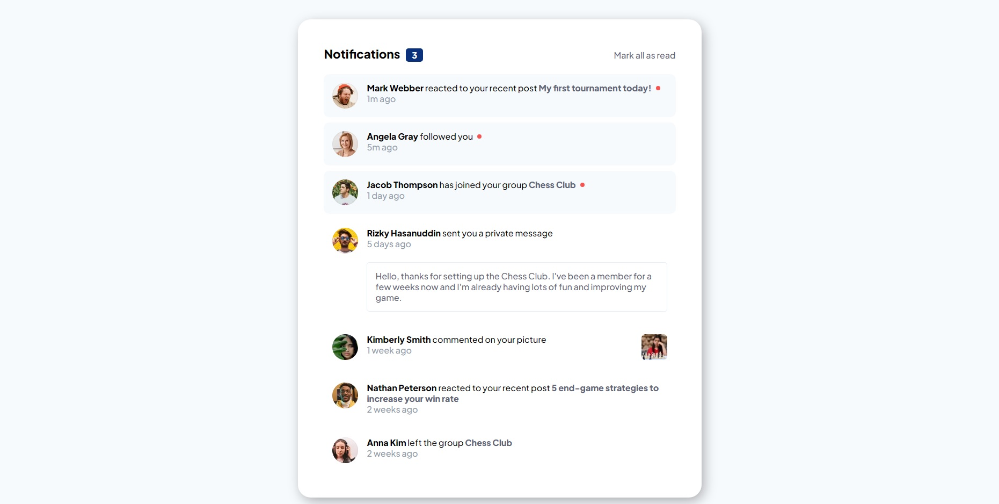

# Frontend Mentor - Notifications page solution

![Status][shield-link] 
[![Front end mentor link][shield-link2]][my-link2] [![Github Link][shield-link3]][my-link3]

[shield-link]: https://img.shields.io/badge/STATUS-COMPLETE-00ff55
[shield-link2]: https://img.shields.io/badge/_Profile-EJ--STONIEEEEE-6abecd?style=for-the-badge&logo=frontendmentor&logoColor=6abecd
[my-link2]: https://www.frontendmentor.io/profile/Stonieeeee
[shield-link3]: https://img.shields.io/badge/_Github-EJ--STONIEEEEE-adbac7?style=for-the-badge&logo=github&logoColor=adbac7
[my-link3]: https://github.com/Stonieeeee

This is a solution to the [Notifications page challenge on Frontend Mentor](https://www.frontendmentor.io/challenges/notifications-page-DqK5QAmKbC). Frontend Mentor challenges help you improve your coding skills by building realistic projects. 

## Table of contents

- [Frontend Mentor - Notifications page solution](#frontend-mentor---notifications-page-solution)
  - [Table of contents](#table-of-contents)
  - [Overview](#overview)
    - [The challenge](#the-challenge)
    - [Screenshot](#screenshot)
    - [Links](#links)
  - [My process](#my-process)
    - [Built with](#built-with)
  - [Author](#author)

## Overview

### The challenge

Users should be able to:

- Distinguish between "unread" and "read" notifications
- Select "Mark all as read" to toggle the visual state of the unread notifications and set the number of unread messages to zero
- View the optimal layout for the interface depending on their device's screen size
- See hover and focus states for all interactive elements on the page

### Screenshot

 

 **This is a screenshot from my solution.** 

### Links

- <a href="https://www.frontendmentor.io/solutions/notification-page-solution-3c3i10fq4b" target="_blank">Solution URL</a>
- <a href="https://stonieeeee.github.io/notification-page-solution/" target="_blank">Live Site URL</a>

## My process

### Built with

- Semantic HTML5 markup
- CSS custom properties
- Flexbox
- CSS Grid

## Author

- Frontend Mentor - <a href="https://www.frontendmentor.io/profile/Stonieeeee" target="_blank">Stonieeeee</a>
- Github - <a href="https://github.com/Stonieeeee" target="_blank">Stonieeeee</a> 